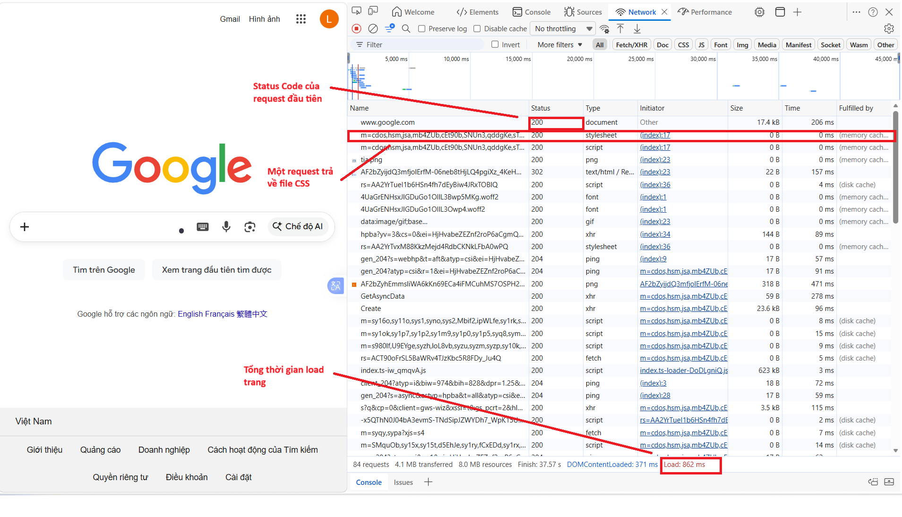
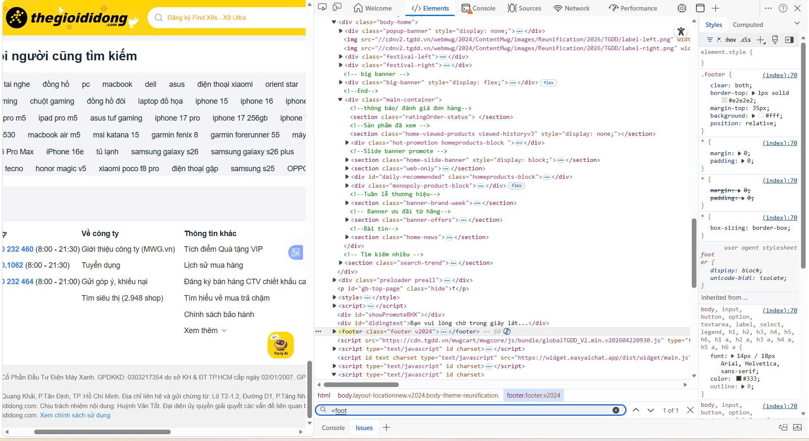
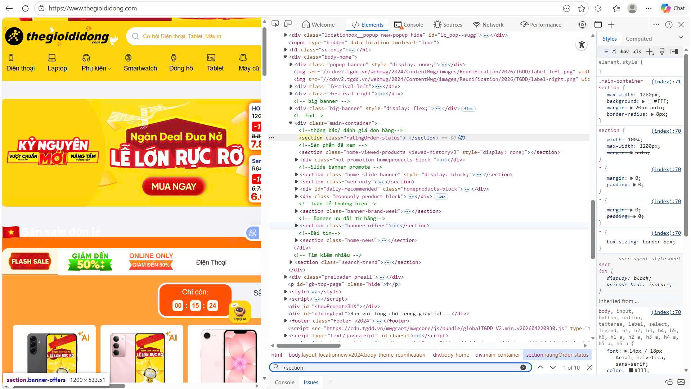
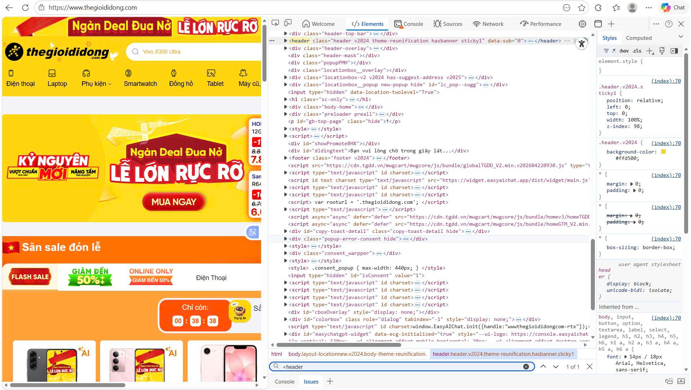
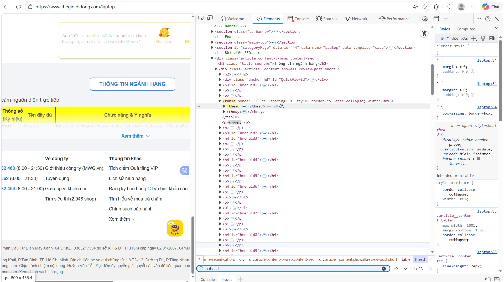
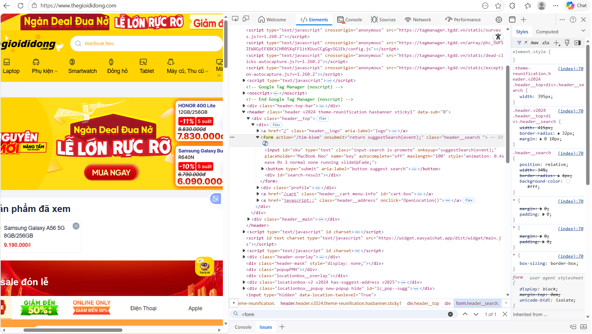

# PHIẾU BÀI TẬP 01
## PHẦN A: ĐỌC HIỂU
### Câu A1:

> Nguồn tham chiếu: 01_introduction_html_universe.md

- Khi gõ http://shopee.vn vào trình duyệt và nhấn Enter, thứ tự các bước là:
    - Bước 1: DNS lookup
    - Bước 2: TCP connection
    - Bước 3: TLS handshake
    - Bước 4: HTTP request gửi đi
    - Bước 5: Server xử lý và trả về HTTP response
    - Bước 6: Parse HTTML -> DOM/CSSOM
    - Bước 7: Render

- tab Network cho thấy thông tin của tất cả các HTTP request của trang



### CÂU A2:
<!--
<div class="header">
    <div class="logo">ShopTLU</div>
    <div class="menu">
        <div><a href="/">Trang chủ</a></div>
        <div><a href="/products">Sản phẩm</a></div>
    </div>
</div>
<div class="main">
    <div class="product">
        <div class="title">iPhone 16 Pro</div>
        <div class="price">25.990.000đ</div>
        <div class="image"></div>
    </div>
</div>
<div class="footer">© 2026 ShopTLU</div>
-->

> Nguồn tham chiếu: 04_visible_part_html.md

- 4 lỗi cơ bản:
    - Lỗi 1: `<div class="header">` Fix: `<header>`
    - Lỗi 2: `<div class="menu">` Fix: Dùng `<nav> <ul>...`
    - Lỗi 3: `<div class="main">` Fix: `<main>`
    - Lỗi 4: `<div class="image"></div>` 
    Fix: `<figure>  </figure>`

### CÂU A3:

> Nguồn tham chiếu: 02_basic_structure_html.md

```txt
┌─────────────────────┐
│ Hộp 1               │ + <div> : block , full width
└─────────────────────┘
Text A, Text B          + <span></span>: cùng dòng
┌─────────────────────┐
│ Hộp 2               │ + <div> : block , xuống dòng mới
└─────────────────────┘
Text C Text D           + <span><strong> : cùng dòng, text D kiểu chữ Bold
┌─────────────────────┐
│ Hộp 3               │ + <div> : block , xuống dòng mới
└─────────────────────┘
```

- Giải thích:
    - `<div>Hộp 1</div>`: là 1 block element, chiếm cả dòng, tự động xuống dòng
    - `<span>Text A</span> <span>Text B</span>`: là inline element, nằm cùng dòng, không tự xuống dòng
    - `<div>Hộp 2</div>`: là 1 block element, chiếm cả dòng, tự động xuống dòng
    - `<span>Text C</span><strong>Text D</strong> `: là inline element, nằm cùng dòng, không tự xuống dòng,`<strong>` in đậm

### CÂU A4:

> Nguồn tham chiếu: 05_tables_hyperlinks.md

```text
- Sự khác nhau:
<thead>	Header	Tiêu đề cột
<tbody>	Body	Dữ liệu chính
<tfoot>	Footer	Tổng kết
```

- Lý do không nên dùng table để tạo layout trang web:
    - Sai ngữ nghĩa: Nếu dùng làm layout sẽ gây hiểu sai nội dung
    - Không linh hoạt: Vì table cứng nên khó co dãn theo màn hình
    - Hiệu năng kém: Trình duyệt phải render toàn bộ table rồi mới hiển thị
    - Không tách biệt nội dung và trình bày
    
## PHẦN B: THỰC HÀNH
### CÂU B3:
```text
- Lỗi 1: Dòng 1 - <!DOCTYPE> sai cú pháp - Sửa thành <!DOCTYPE html>
- Lỗi 2: Dòng 2 - Thiếu lang - Sửa thành <html lang="vi">
- Lỗi 3: Dòng 4 - Thẻ <title> không đóng - Thêm </title>
- Lỗi 4: Dòng 5 - charset sai(utf8) - Sửa thành UTF-8
- Lỗi 5: Dòng 8 - <h1> không đóng đúng - Sửa thành </h1>
- Lỗi 6: Dòng 12 - Thẻ <a> không đóng - Sủa thành </a>
- Lỗi 7: Dòng 20 -  thiếu " " và alt - Thêm " " và alt
- Lỗi 8: Dòng 22 - Thẻ </b> đóng sai vị trí - Đóng trước </p>
- Lỗi 9: Dòng 27 - <table> không đúng cấu trúc - Thêm <thead>, <tbody>, <tfoot>
- Lỗi 10: Dòng 40 - Dùng <main> 2 lần - Sửa thành <aside>
- Lỗi 11: Dòng 45 - Thiếu </p> - Thêm </p>
- Lỗi 12: Thiếu meta viewport — Thêm thẻ viewport trong <head>
- Lỗi 13: Dòng 21 - Thay thẻ <p></p> thành <figcaption></figcaption>
- Lỗi 14: Thêm thẻ <style></style> trong <head> để định dạng cho bảng
- Lỗi 15: Dòng 34 - Giá sai so với trong <section> - Sửa thành 25.990.000
- Lỗi 16: Dòng 33 - Tên sản phẩm sai - Sửa thành iPhone 16 Pro
```
### CÂU B4: Dùng web thegioididong.com
- Câu 1:

    


    


    

- Câu 2:
    
    
    
    - Table này hiển thị thông tin nghành hàng và bảng giải thích thông số kỹ thuật
    - Có dùng `<thead> và <tbody>`

- Câu 3:

    
    - action: /tim-kiem
    - method: không ghi
    - Các input types được dùng: text, submit
    
## PHẦN C: SUY LUẬN

### CÂU C2:
```
Quan điểm “dùng <div> cho mọi thứ rồi thêm class là đủ” nghe có vẻ tiện, nhưng về kỹ thuật thì không ổn.

Thứ nhất là SEO. Các công cụ tìm kiếm phân tích cấu trúc HTML để hiểu nội dung trang. Khi bạn dùng các thẻ semantic như <header>, <nav>, <main>, <article>, <section>, nội dung được phân loại rõ ràng (đâu là bài viết chính, đâu là điều hướng). Nếu tất cả đều là <div>, Google phải “đoán”, dễ hiểu sai hoặc đánh giá thấp trang → ảnh hưởng trực tiếp đến thứ hạng.

Thứ hai là accessibility (khả năng truy cập). Người dùng khiếm thị sử dụng screen reader để duyệt web. Các thẻ semantic giúp thiết bị này đọc đúng ngữ cảnh: “đây là navigation”, “đây là article”. Nếu chỉ dùng <div>, trải nghiệm sẽ rất kém vì không có thông tin ngữ nghĩa.

```


    


    