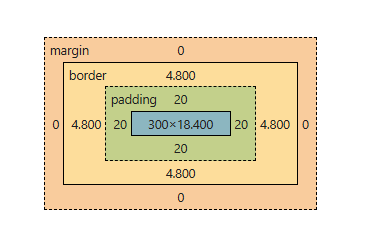
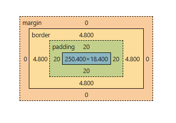
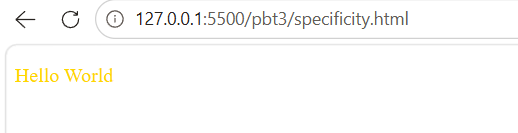

# PHIẾU BÀI TẬP 03
## PHẦN A: ĐỌC HIỂU
### Câu A1:

3 cách nhúng css vào html:
- Inline CSS (trong thẻ)
    - vd: `<h1 style="color: red; font-size: 24px;">Phương Linh</h1>`
    - Ưu điểm:
        - Nhanh, đơn giản
        - Áp dụng ngay cho 1 phần tử cụ thể
        - Không cần tạo file CSS riêng
    - Nhược điểm:
        - Code khó đọc khi nhiều style
        - Khó tái sử dụng
        - Khó bảo trì
        - Làm HTML dài và rối
    - Khi nào nên dùng: 
        - Test nhanh giao diện
        - Chỉnh tạm 1 phần từ nhỏ
        - Email html thường dùng inline css
- Internal CSS text `(trong <style>)`
    - vd:
    ```text
        <!DOCTYPE html>
        <html>
        <head>
            <style>
                p {
                    color: blue;
                    font-size: 18px;
                }
            </style>
        </head>

        <body>
            <p>Phương Linh</p>
        </body>
        </html>
    ```
    - Ưu điểm:
        - Code gọn hơn
        - Dễ quản lý hơn
        - Áp dụng cho nhiều phần tử trong cùng trang
    - Nhược điểm:
        - Chỉ dùng cho 1 file html
        - Không tái sử dụng giữa nhiều trang
        - File html dài
    - Khi nào nên dùng:
        - Web nhỏ
        - Trang demo hoặc bài tập
        - css chỉ dùng riêng cho 1 trang
- External CSS (file riêng) 
    - vd:
        - File html:
        ```text
        <!DOCTYPE html>
        <html>
        <head>
            <link rel="stylesheet" href="style.css">
        </head>

        <body>
            <p>Xin chào</p>
        </body>
        </html>
        ```
        - File css:
        ```text
        p {
            color: green;
            font-size: 22px;
        }
        ```
    - Ưu điểm:
        - Quản lý chuyên nghiệp
        - Tái sử dụng cho nhiều trang
        - html sạch và dễ lọc
        - dễ bảo trì
        - Web tải nhanh hơn nhờ cache css
    - Nhược điểm:
        - cần thêm file riêng
        - sai đường dẫn thì css không hoạt động
    - Khi nào nên dùng:
        - dự án thật
        - Web nhiều trang
        - làm việc nhóm
        - css lớn và phức tạp

Câu hỏi thêm: Thứ tự ưu tiên: Inline CSS > Internal CSS > External CSS

### Câu A2:

1. `h1 `-> Chọn: ShopTLU
2. `.price `-> Chọn: 25.990.000đ, 45.990.000đ
3. `#app header` -> Chọn: ShopTLU, Home, Products, About
4. `nav a:first-child ` -> Chọn: Home
5. `.product.featured h2` -> Chọn: MacBook Pro
6. `article > p` -> Chọn: 25.990.000đ, Mô tả sản phẩm..., 45.990.000đ, Mô tả sản phẩm...
7. `a[href="/"]` -> Chọn: Home
8. `.top-bar.dark h1` -> Chọn: ShopTLU

### Câu A3:

- Trường hợp 1:
  - Chiều rộng hiển thị = 450
  - Không gian chiếm trên trang = 470
- Trường hợp 2:
  - Chiều rộng hiển thị = 400
  - Kích thước content thực tế = 350
  - Không gian chiếm trên trang = 420
- Trường hợp 3:
  - Khoảng cách giữa box-a và box-b = 40
  - Không phải là 65px vì CSS lấy giá trị lớn hơn

- Nếu .box-a có margin-bottom: -10px và .box-b có margin-top: 40px, khoảng cách = 40 + (-10) = 30px

### Câu A4:

1.
- Rule A:
  - ID: 0
  - Class: 0
  - tag `p`: 1
  - specificity: (0,0,1)
- Rule B:
  - ID: 0
  - Class `.price`: 1
  - tag: 0
  - specificity: (0,1,0)
- Rule C:
  - ID `#main-price`: 1
  - Class: 0
  - tag: 0
  - specificity: (1,0,0)
- Rule D:
  - ID: 0
  - Class `.price`: 1
  - tag `p`: 1
  - specificity: (0,1,1)

2.
- Element sẽ có màu đỏ
- Vì CSS ưu tiên ID > class > tag mà `#main-price { color: red; }` mạnh nhất

3. Nếu thêm `<p class="price" id="main-price" style="color: orange;">` thì element sẽ có màu cam.
4. Nếu Rule A thêm !important, element có màu đen. Vì khi một thuộc tính được gán !important, nó sẽ phá vỡ mọi quy tắc tính điểm specificity thông thường và chiếm quyền ưu tiên cao nhất (cao hơn cả Inline style và ID selector).

## PHẦN B: THỰC HÀNH CODE
### CÂU B1:
 - Các loại selector được dùng;
    - Element selector: body, header, table
    - Class selector: .active
    - ID selector: #about, #contact	
    - Descendant selector: nav a,header h1
    - Pseudo-class selector: a:hover, tr:nth-child(even)

### CÂU B2:
PHẦN 1:

- Hộp 1 (content-box): chiều rộng thực tế = 350 px (đo từ DevTools)


- Hộp 2 (border-box): chiều rộng thực tế = 300 px (đo từ DevTools)



- Giải thích sự khác biệt: 
    - `box-sizing: content-box` làm padding và border cộng thêm vào kích thước thật của phần tử
    - `box-sizing: border-box` thu hẹp phần content bên trong nên kích thước vẫn được giữ nguyên

PHẦN 2:


### CÂU B3:

10 rules + specificity score
1. p → (0,0,1)
2. .highlight → (0,1,0)
3. .text → (0,1,0)
4. p.text → (0,1,1)
5. p.highlight → (0,1,1)
6. .text.highlight → (0,2,0)
7. p.text.highlight → (0,2,1)
8. #demo → (1,0,0)
9. p#demo → (1,0,1)
10. p#demo.text.highlight → (1,2,1)

Element cuối cùng hiển thị màu gold, vì rule: p#demo.text.highlight có specificity cao nhất: (1,2,1) Nó mạnh hơn tất cả các rule còn lại.



Thay đổi thứ tự rules có ảnh hưởng không?
- Nếu specificity khác nhau:
→ thứ tự KHÔNG quan trọng.

- Rule có specificity cao hơn vẫn thắng.

- Nếu specificity bằng nhau:
→ rule viết SAU sẽ thắng.

## PHẦN C: DEBUG VÀ SUY LUẬN

### CÂU C1:

1.

- Chiều rộng thực tế của sidebar = 342px
- Chiều rộng thực tế của content = 722px

2. Layout bị vỡ là do tổng chiểu rộng của 2 khối là 1064 > container bằng 960px, `content` không còn đủ chỗ trống nên trình duyệt tự động đẩy nó xuống dòng mới

3. 2 cách sửa:

- Cách 1: dùng border-box
  - sidebar: width 300px gồm padding và border
  - content: width 660px gồm padding và border

- Cách 2: Tính toán lại width
  - sidebar width mới: $300 - (20 \times 2) - (1 \times 2) =$ 258px
  - content width mới: $660 - (30 \times 2) - (1 \times 2) =$ 598px
    -> tổng = 960px

### CÂU C2:

1. Sản phẩm A có

- `font-size` = 20px. Mặc dù nằm trong `.container` (14px), nhưng h2 có class `.title` nằm trong `.card`. `.card .title` trỏ trực tiếp và có độ ưu tiên cao hơn giá trị kế thừa từ cha.
- `color` = green. Vì có từ khóa `!important`, quy tắc `.highlight` sẽ chiến thắng mọi cấp độ Specificity khác

2. "Mô tả sản phẩm" (p trong card featured) có `color` = blue.

- Thẻ `p` này có quy tắc `.card p { color: inherit; }`. Thuộc tính `inherit` bắt buộc phần tử phải lấy giá trị màu từ phần tử cha trực tiếp của nó là `.card`.

3. "Sản phẩm B" (h2) có

- `font-size` = 20px. Quy tắc `.card .title` thiết lập kích thước chữ 20px cho mọi phần tử `.title` nằm bên trong `.card`.
- `color` = blue. Rule `#featured .title` không còn hiệu lực vì thẻ này nằm ngoài id `featured`. Chỉ còn rule `.card .title`

4. "Mô tả sản phẩm B" (p.highlight) có `color` = green. Dù nó là thẻ `p` đang có rule `inherit` từ `.card` màu xanh, nhưng sự xuất hiện của class `.highlight` đi kèm `!important `đã phá vỡ mọi quy tắc kế thừa và gán màu xanh lá cây cho nó.


