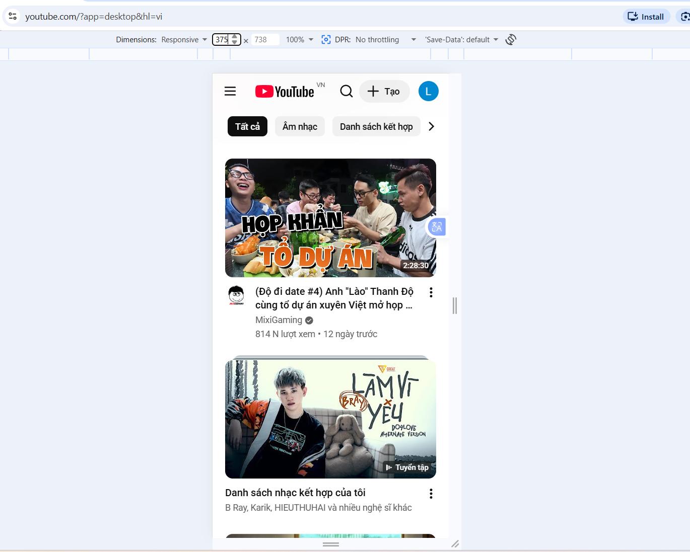
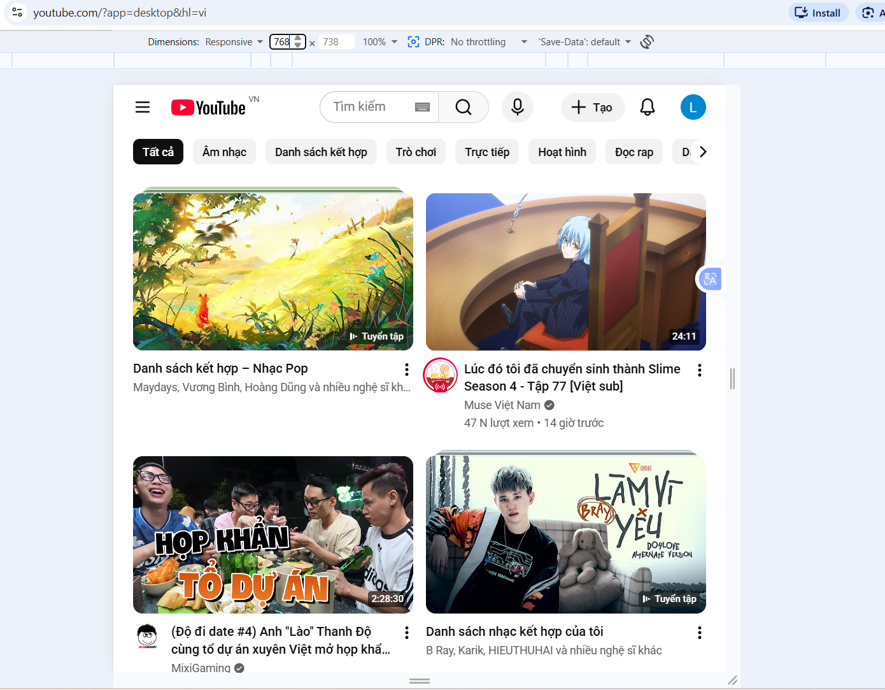
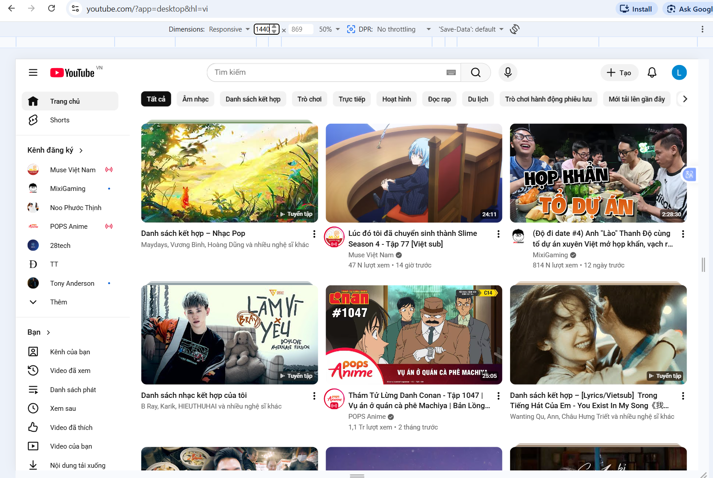
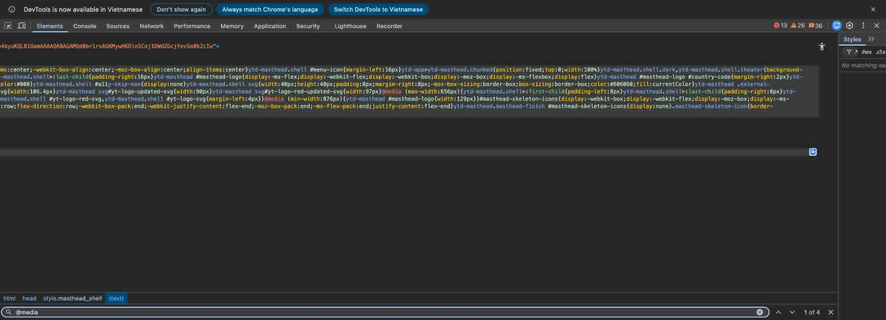

# PHẦN A: ĐỌC HIỂU
## CÂU A1:
1. Thẻ `<meta viewport>`: `<meta name="viewport" content="width=device-width, initial-scale=1.0">`
- `name="viewport"`: Báo cho trình duyệt đây là cấu hình viewport cho thiết bị di động
- `width=device-width`: Chiều rộng viewport = đúng chiều rộng màn hình thiết bị
- `initial-scale=1.0`: Mức zoom ban đầu là 100%
2. Thiếu dòng này thì iPhone sẽ coi trang web là web desktop và thu nhỏ xíu lại. Luôn đặt trong `<head>`.

3. Mobile-First và Desktop-First khác nhau thế nào?

| Tiêu chí         | Mobile-First                 | Desktop-First                  |
| ---------------- | ---------------------------- | ------------------------------ |
| Thiết kế ban đầu | Viết cho mobile trước        | Viết cho desktop trước         |
| Media query      | Dùng `min-width`             | Dùng `max-width`               |
| Responsive       | Mở rộng dần lên màn hình lớn | Thu nhỏ dần xuống màn hình nhỏ |
| Hiệu năng        | Tốt hơn cho mobile           | CSS thường nặng hơn            |
| Cách tiếp cận    | Progressive Enhancement      | Graceful Degradation           |

- VD Mobile-First:

```css
  @media (min-width: 768px) {
    .container {
      background: lightblue;
      padding: 40px;
    }
  }
```
-  VD Desktop-First:

 ```css
  @media (max-width: 768px) {
    .container {
      background: pink;
      padding: 20px;
    }
  }
  ```
Mobile-First được khuyên dùng vì:
  - Đa số người dùng dùng điện thoại
  - Google ưu tiên mobile indexing
  - Mobile constraints khó hơn desktop

## Câu A2:

Breakpoints chuẩn:  
| Tên | Min-width | Thiết bị điển hình | Ví dụ |
|---|---|---|---|
| **Mobile** | < 576px | iPhone SE, các điện thoại nhỏ | 1 cột
| **Mobile L** | ≥ 576px | iPhone Plus, điện thoại ngang | 2 cột
| **Tablet** | ≥ 768px | iPad dọc, tablet | 2-3 cột
| **Desktop** | ≥ 992px | Laptop nhỏ | 3-4 cột
| **Desktop L** | ≥ 1200px | Desktop, laptop lớn | 4 cột
| **Desktop XL** | ≥ 1400px | Màn hình 4K, ultrawide | 5-6 cột

## Câu A3:

| Chiều rộng màn hình | `.container` width |
| ------------------- | ------------------ |
| 375px (iPhone SE)   | 100%               |
| 600px               | 540px              |
| 800px               | 720                |
| 1000px              | 960                |
| 1400px              | 1140               |

## Câu A4:

- 4 tính năng chính của SCSS:
  - Variables: SCSS cho phép lưu giá trị vào biến bằng `$`

  ```css
  $primary-color: #ff69b4;
  $text-color: #333;

  button {
    background: $primary-color;
    color: $text-color;
  }
  ```

  - Nesting: Viết CSS lồng nhau

  ```css
  .navbar {
    background: pink;
    ul {
      display: flex;
    }
    li {
      list-style: none;
    }
    a {
      text-decoration: none;
      color: black;
    }
  }
  ```

  - Mixins: Tái sử dụng block CSS

  ```css
  @mixin flex-center {
    display: flex;
    justify-content: center;
    align-items: center;
  }

  .hero {
    @include flex-center;
    height: 100vh;
  }
  ```

  - `@extend `/ Inheritance: Cho phép class kế thừa CSS từ class khác

  ```css
  .button {
    padding: 10px 20px;
    border-radius: 8px;
  }

  .btn-primary {
    @extend .button;

    background: blue;
  }

  .btn-danger {
    @extend .button;

    background: red;
  }
  ```

- Trình duyệt KHÔNG đọc được `.scss` vì:
  - Nó không phải là css chuẩn
  - Nó là preprocessor syntax
  - Trình duyệt chỉ hiểu html, css, js
- Dùng `SCSS Compiler` để SCSS → CSS

# PHẦN B: THỰC HÀNH CODE
## CÂU B3: 
sass scss/style.scss style.css

# PHẦN C: PHÂN TÍCH
## CÂU C1:

## Câu C1:



- Navigation:
  - Menu chính: Thanh sidebar bên trái ở bản Desktop (chứa Trang chủ, Shorts, Đăng ký, Bạn) đã bị ẩn hoàn toàn. Thay vào đó, một nút Hamburger Menu xuất hiện ở góc trên cùng bên trái của bản Mobile để người dùng bấm vào khi cần mở menu ẩn
  - Thanh tìm kiếm: Khung tìm kiếm dài ở chính giữa bản Desktop đã được thu gọn lại thành duy nhất một icon kính lúp trên Mobile. Khi người dùng chạm vào icon này thì khung nhập liệu mới hiện ra
  - Thanh danh mục phụ: Ở bản Desktop, các tag như "Tất cả", "Âm nhạc", "Trò chơi"... trải dài theo hàng ngang. Sang Mobile, chúng được giữ lại nhưng bọc trong một container hỗ trợ hành vi vuốt ngang, che bớt các tag phía sau kèm một nút mũi tên để người dùng lướt xem
- Lưới chuyển về dạng 1 cột duy nhất, các video được xếp chồng lên nhau theo chiều dọc
- Các element bị ẩn:
  - Khung Search và icon Micro nhập liệu giọng nói trực tiếp trên topbar bị ẩn (gộp vào icon kính lúp)
  - Nút "+ Tạo" trên header biến mất
  - Avatar kênh ở dưới mỗi video
- Font size có thay đổi



- Navigation:
  - Thanh danh mục phụ theo cơ chế vuốt ngang
  - Menu chính bị ẩn thau bằng 1 nút Hamburger xuất hiện ở góc trên cùng bên trái
- Lưới chia thành 2 cột trên một hàng.
- Chỉ còn menu chính bị ẩn
- Font size: gần như chưa đổi



- Navigation: chưa chuyển thành hamburger/dropdown
- Lưới chia thành 3 cột trên một hàng.
- Các element đều giữ lại
- Font size: không đổi

3.  

- 2 media queries mà trang đó đang dùng:
  - @media (max-width: 656px)
  - @media (min-width: 876px)


## Câu C2:

```
MOBILE (< 768px)
┌─────────────────────────┐
│ LOGO                    │
├─────────────────────────┤
│                         │
│     HERO IMAGE          │
│   (toàn chiều rộng)     │
│                         │
├─────────────────────────┤
│  [món ăn]               │
│  [món ăn]               │
│  [món ăn]               │
│  [món ăn]               │
├─────────────────────────┤
│  FORM ĐẶT BÀN           │
│  Ngày:                  │
│  Giờ:                   │
│  Số người:              │
│  Ghi chú:               │
│  [  ĐẶT BÀN NGAY  ]     │
├─────────────────────────┤
│  BẢN ĐỒ GOOGLE MAPS     │
├─────────────────────────┤
│  FOOTER                 │
└─────────────────────────┘
```

```
Tablet (768px - 1023px)
┌─────────────────────────┐
│ LOGO              SĐT   │
├─────────────────────────┤
│                         │
│     HERO IMAGE          │
│   (toàn chiều rộng)     │
│                         │
├─────────────────────────┤
│  [món ăn]    [món ăn]   │
│  [món ăn]    [món ăn]   │
├─────────────────────────┤
│  FORM ĐẶT BÀN           │
│  Ngày:       Giờ:       │
│  Số ng:   Ghi chú:      │
│                         │
│  [  ĐẶT BÀN NGAY  ]     │
├─────────────────────────┤
│  BẢN ĐỒ GOOGLE MAPS     │
├─────────────────────────┤
│  FOOTER                 │
└─────────────────────────┘
```

```
DESKTOP (≥ 1024px)
┌─────────────────────────────────────────────────────────┐
│ LOGO                              Giới thiệu  MENU SĐT  │
├─────────────────────────────────────────────────────────┤
│                                                         │
│                    HERO IMAGE                           │
│                                                         │
├────────────────────────────────────┬────────────────────┤
│  GRID ẢNH MÓN ĂN (3 cột)           │  FORM ĐẶT BÀN      │
│  [ảnh 1]  [ảnh 2]  [ảnh 3]         │  Ngày:             │
│  [ảnh 4]  [ảnh 5]  [ảnh 6]         │  Giờ:              │
│                                    │  Số ng:            │
│                                    │  Ghi chú:          │
│                                    │                    │
│                                    │  [  ĐẶT NGAY  ]    │
├────────────────────────────────────┴────────────────────┤
│                  BẢN ĐỒ GOOGLE MAPS                     │
├─────────────────────────────────────────────────────────┤
│                      FOOTER (4 cột)                     │
└─────────────────────────────────────────────────────────┘
```

- CSS skeleton :

```css
* {
  margin: 0;
  padding: 0;
  box-sizing: border-box;
}

body {
  font-family: Arial, sans-serif;
}

/* mobile */

.container {
  display: grid;
  grid-template-columns: 1fr;
  gap: 16px;
  padding: 16px;
}

.header {
  display: flex;
  justify-content: space-between;
  align-items: center;
}

.hero img {
  width: 100%;
  height: auto;
}

.food-grid {
  display: grid;
  grid-template-columns: 1fr;
  gap: 16px;
}

.booking-form {
  display: grid;
  gap: 12px;
}

.map {
  display: none;
}

.footer {
  text-align: center;
  padding: 20px;
}

/* tablet */

@media (min-width: 768px) {
  .food-grid {
    grid-template-columns: repeat(2, 1fr);
  }

  .map {
    display: block;
  }
}

/* destop */

@media (min-width: 1024px) {
  .main-layout {
    display: grid;
    grid-template-columns: 2fr 1fr;
    gap: 24px;
  }

  .food-grid {
    grid-template-columns: repeat(3, 1fr);
  }

  .sidebar {
    display: block;
  }
}
```


